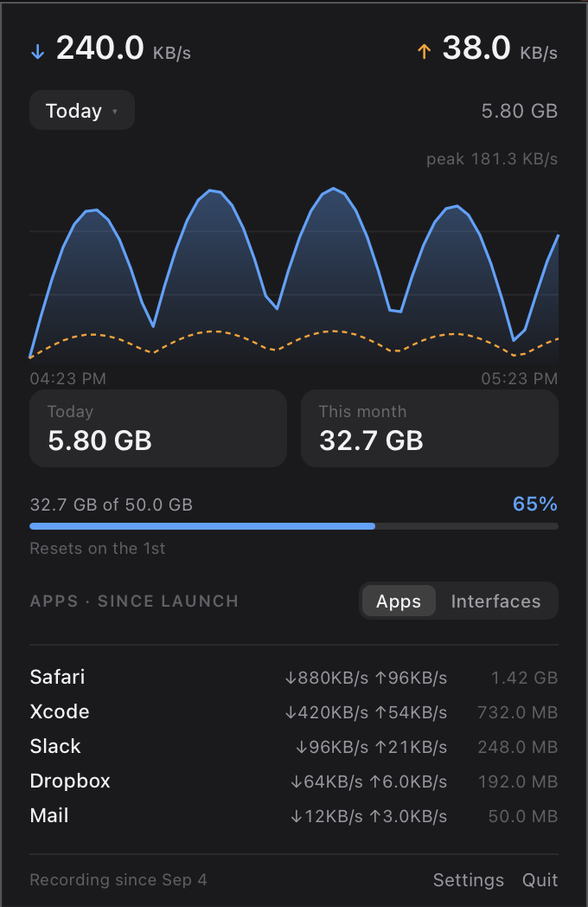
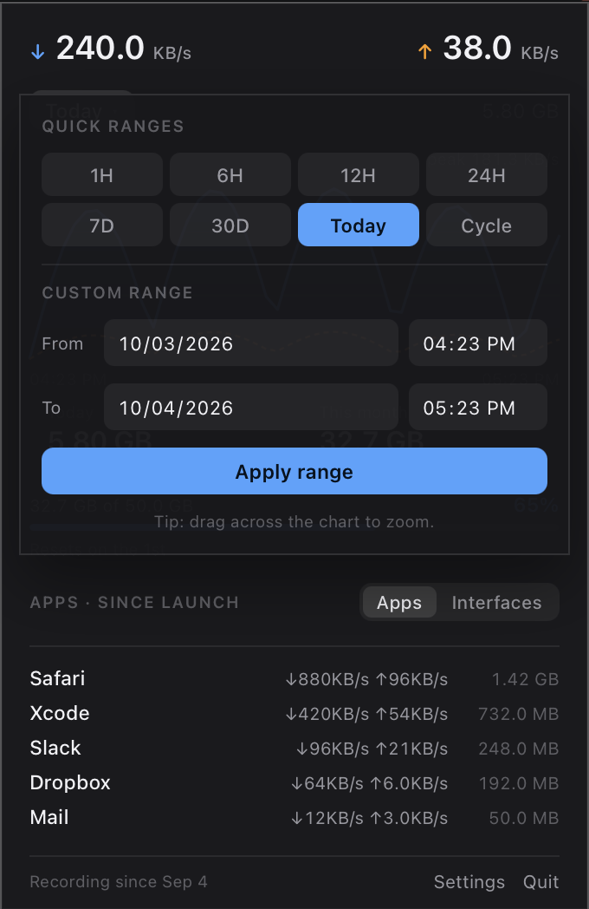
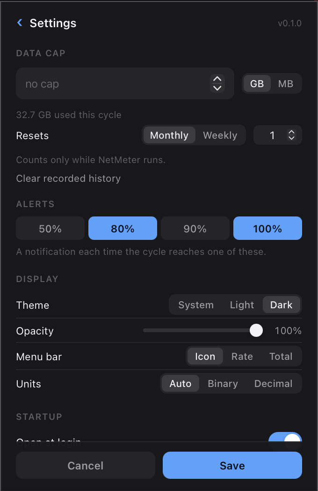

<p align="center">
  
</p>

<h1 align="center">NetMeter</h1>

<p align="center">
  A small, quiet network usage monitor for the macOS menu bar.<br>
  Live rate, any time range, per-app usage — and how much of your data plan is gone.
</p>

<p align="center">
  <a href="#install">Install</a> ·
  <a href="#features">Features</a> ·
  <a href="#screenshots">Screenshots</a> ·
  <a href="#configuration">Configuration</a> ·
  <a href="#the-command-line">CLI</a> ·
  <a href="#uninstall">Uninstall</a> ·
  <a href="CHANGELOG.md">Changelog</a>
</p>

<p align="center">
  <a href="https://github.com/omerdikyol/netmeter/releases"></a>
  <a href="https://github.com/omerdikyol/netmeter/releases"></a>
  <a href="https://github.com/omerdikyol/netmeter/actions/workflows/ci.yml"></a>
  <a href="https://github.com/omerdikyol/netmeter/releases/latest"></a>
  
  
</p>

<p align="center">
  
</p>

## Why another one of these

[Stats](https://github.com/exelban/stats) and iStat Menus already show network
traffic. Two things are different here:

- **It is built around a data cap.** Set your plan's size and reset day, and the
  panel is about how much of it is gone and when it renews — with notifications
  as you cross the thresholds you picked.
- **It needs no privileges.** No Accessibility permission, no root, no kernel
  extension, no network filter. It reads the same per-interface counters Activity
  Monitor does, and `nettop` for per-app numbers.

## Features

| | |
|---|---|
| **Live rate** | Download and upload in the panel, updated every second |
| **Any time range** | 1H / 6H / 12H / 24H / 7D / 30D / Today / Cycle, an explicit From–To picker, or drag across the graph to zoom |
| **Per app** | The busiest processes since launch, or per-interface totals for the selected range |
| **Data cap** | Progress against your plan, a reset day, and threshold notifications |
| **Menu bar** | A quiet activity glyph, or the live rate, or the cycle total — your choice |
| **Looks how you like** | Light or dark, or follow the system, with a panel opacity slider |
| **Starts with you** | Optional launch at login, so the totals have no gaps |
| **Private** | A SQLite file on your machine. No accounts, nothing uploaded |

## Install

Homebrew:

```sh
brew tap omerdikyol/netmeter
brew install --cask netmeter
```

Or download `NetMeter-macos-universal.dmg` from
[Releases](https://github.com/omerdikyol/netmeter/releases), open it, and drag
NetMeter into Applications. There is a `.zip` too, if you prefer.

> **Releases are unsigned for now**, so macOS refuses the first launch of a
> downloaded copy. Right-click the app and choose **Open**, or clear the flag:
> `xattr -dr com.apple.quarantine /Applications/NetMeter.app`
> Signing and notarization are wired into the release workflow and switch on as
> soon as the credentials are set.

From source:

```sh
git clone https://github.com/omerdikyol/netmeter
cd netmeter
cargo build --release
packaging/macos/bundle.sh
open dist/NetMeter.app
```

**Requirements:** macOS 13 or newer, Apple silicon or Intel. Building needs
Rust 1.80+.

## Using it

NetMeter sits in the menu bar as a small activity glyph so it stays out of the
way. **Left-click** it for the panel; **right-click** for a short menu with
Settings and Quit.

The panel is four things: the live rate, the graph with its range control,
today's and this cycle's totals, and the usage list. The gear in the footer
opens settings.

### If the icon does not appear

Menu bar managers such as [Ice](https://github.com/jordanbaird/Ice) or Bartender
hide new items by default — they are moved off-screen until you reveal them. If
NetMeter is running but you cannot see it, open that manager and move NetMeter to
the always-visible section.

## Screenshots

| Choosing a time range | Settings |
| :---: | :---: |
|  |  |

## Configuration

Everything is settable in the panel, but it is just a TOML file, created on first
run. `netmeter config` prints the paths and the current contents.

```toml
[general]
sample_interval_ms = 1000
launch_at_login = false
menu_bar = "icon"      # icon | rate | total
unit = "auto"          # auto | binary | decimal

[appearance]
theme = "system"       # system | light | dark
opacity = 0.72

[plan]
enabled = true
cap_bytes = 50000000000
cycle = "monthly"      # weekly | monthly
reset_day = 15
warn_at = [0.8, 1.0]
```

History is a SQLite file beside it, pruned to 90 days. Note that NetMeter only
samples while it is running, so the totals cover that time — the panel says since
when.

## The command line

The same engine, without the tray:

```sh
netmeter status                             # per-interface counters right now
netmeter report --range today               # usage today
netmeter report --range cycle               # usage this billing cycle
netmeter report --from 2026-09-01 --to 2026-10-01
netmeter report --iface en6 --json          # one interface, machine readable
netmeter sample --interval 1                # live rate in the terminal
```

`report` and `sample` are read-only: they never touch the stored history.

## How it works

- **No bundled browser.** The tray is native ([`tray-icon`] + [`tao`]); the panel
  is drawn by the system webview, so nothing like Chromium ships with the app.
- **Counters, not guesses.** Per-interface bytes come from [`sysinfo`]
  (`getifaddrs` on macOS). Interface counters restart on reboot or link flap, so a
  value that goes backwards is treated as a reset — NetMeter never reports a
  negative or inflated delta.
- **Per-app usage** is `nettop` sampled every few seconds and diffed, so those
  numbers count only what happened while NetMeter was running.
- **Small.** One binary plus the system webview. No background service, no
  helper, no login item unless you ask for one.

## Uninstall

```sh
brew uninstall --cask netmeter            # add --zap to remove your history too
```

Or just drag `NetMeter.app` to the Trash. Configuration and history live in
`~/Library/Application Support/dev.omerdikyol.netmeter`.

## macOS only, for now

The panel renders through `wry`, which needs a GTK event loop on Linux that this
app does not set up yet, and Windows has never been exercised. Rather than claim
three platforms and ship one, this release says macOS and means it.
`crates/netmeter-core` — sampling, storage, statistics, configuration — is
platform-neutral and would be the base for other front ends.

## Development

The panel can be shown without clicking the tray icon, which is handy while
working on the UI:

```sh
NETMETER_PREVIEW_PANEL=1 cargo run                 # open the panel on launch
NETMETER_PREVIEW_PANEL=1 NETMETER_PREVIEW_DELAY_MS=4000 cargo run
                                                   # ...a few seconds later
NETMETER_PREVIEW_SHEET=1 cargo run                 # with the range picker open
NETMETER_PREVIEW_SETTINGS=1 cargo run              # on the settings screen
NETMETER_KEEP_OPEN=1 cargo run                     # never dismiss on focus loss
NETMETER_DEMO=1 cargo run                          # draw invented data, not yours
```

`NETMETER_DEMO` is what the screenshots in this README were taken with: it makes
the panel ignore the real state and draw a fixed, made-up dataset, and squares
its corners at full opacity so a capture contains nothing but panel pixels.

```
crates/netmeter-core   sampling, storage, stats, config (no UI; unit tested)
crates/netmeter        tray app, panel host, per-app sampler, CLI
ui/index.html          the panel itself (HTML/CSS/JS, no build step)
packaging/macos        Info.plist, bundle, signing and icon scripts
packaging/homebrew     the cask
```

Contributions are welcome. `cargo test` and
`cargo clippy --all-targets -- -D warnings` should both be clean before a pull
request.

## Roadmap

- [x] Sampling, storage and reporting core, with a CLI
- [x] Menu bar app and the panel
- [x] Per-interface and per-app views, any time range
- [x] Data cap, reset cycle and threshold notifications
- [x] Universal packaging, Homebrew cask and a generated icon
- [ ] Signed and notarized releases
- [ ] Linux and Windows front ends

## License

Dual-licensed under either of [MIT](LICENSE-MIT) or
[Apache-2.0](LICENSE-APACHE), at your option.

The bundled JetBrains Mono font (used only when the menu bar shows a number) is
under the SIL Open Font License 1.1 — see `assets/fonts/OFL.txt`.

[`tray-icon`]: https://github.com/tauri-apps/tray-icon
[`tao`]: https://github.com/tauri-apps/tao
[`sysinfo`]: https://github.com/GuillaumeGomez/sysinfo
